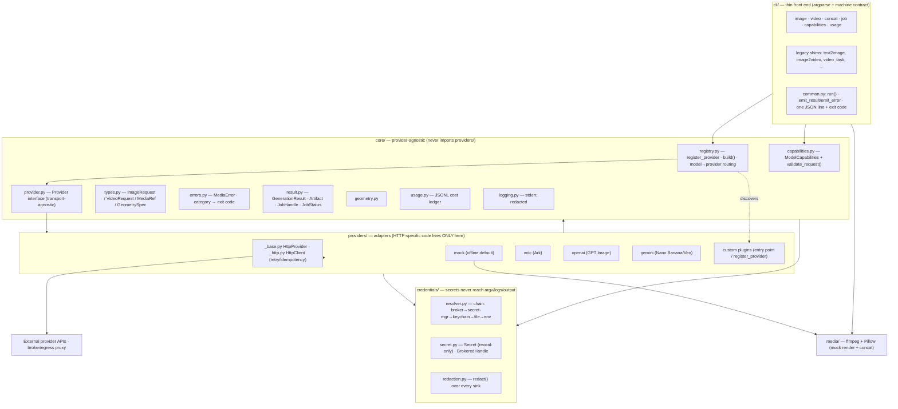
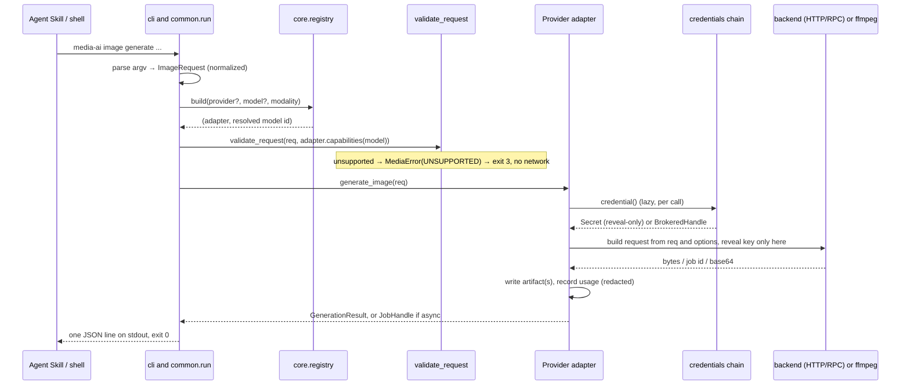

# Architecture

`media-ai` is a provider- and model-agnostic multimodal generation CLI. A thin CLI
front end turns argv into a **normalized request**, a registry resolves a
**provider adapter**, and the adapter maps the request to one backend's wire format
and returns a **normalized result**. Everything above the adapter is shared; each
backend's idiosyncrasies live only inside its adapter.

## Layered structure

**The dependency rule:** arrows only point down/inward. `core/` never imports
`providers/`; the CLI never imports a concrete provider (it goes through the
registry). This is what keeps the core provider-agnostic — and what a change must
not violate.

## Request lifecycle

Failures anywhere become a categorized `MediaError`; `common.run()` prints
`{"ok": false, "error": {…}}` and returns the category's exit code. Async video
(`--wait false`) returns a `JobHandle`; `media-ai job query --output` later polls
and finalizes (downloads) via the same adapter.

## Module responsibilities

| Area | What it owns |
|---|---|
| `core/types.py` | Normalized `ImageRequest`/`VideoRequest`, `MediaRef` (any input source), `GeometrySpec` |
| `core/capabilities.py` | Per-model `ModelCapabilities` schema + `validate_request()` — drives discovery **and** gating |
| `core/registry.py` | Dynamic provider registry, `register_provider()`, entry-point discovery, model→provider routing |
| `core/provider.py` | The `Provider` interface (no transport assumptions) |
| `core/{errors,result}.py` | Error taxonomy→exit codes; result/job types + the stdout JSON contract (`schema_version`) |
| `core/{geometry,usage,logging}.py` | Geometry primitives; JSONL cost ledger; redacted stderr logging |
| `credentials/` | Resolver chain, reveal-only `Secret`/`BrokeredHandle`, `redact()` |
| `providers/_base.py`,`_http.py` | Optional HTTP layer: auth/broker header building, retry + idempotency |
| `providers/{mock,volc,openai,gemini}.py` | One adapter each: wire mapping, capability declarations, error mapping |
| `media/` | ffmpeg (clip/concat) + Pillow (placeholder render) — mock backend + `concat` |
| `cli/` | argparse front ends; `common.py` owns the machine contract |

## Cross-cutting concerns

- **Capability gating** — the same `ModelCapabilities` powers `media-ai
  capabilities` (discovery) and `validate_request` (pre-flight). Provider-specific
  functions ride on `--option key=value`, allowed only if the model declares them.
- **Credential trust boundary** — the CLI holds no secret; the adapter resolves one
  lazily and reveals it only at request-build time. In brokered mode
  (`MEDIA_CRED_BROKER`) the adapter holds only a session token and the broker
  injects the key at egress. Every sink is redacted.
- **Machine contract** — one JSON object on stdout (success or failure), redacted
  logs on stderr, category-specific exit codes. Built once in `cli/common.run()`.
- **Async jobs** — a `JobHandle`/`JobStatus` abstraction over per-provider ids
  (Volc task-id, Gemini `operations/…`), with a finalize/download step and
  signal-driven cancel for blocking Volc polls. (OpenAI is image-only/synchronous.)

## Extension points

- **Custom provider** — subclass `Provider` (or `HttpProvider`), declare
  `ModelCapabilities`, register via `register_provider()` or a `media_ai.providers`
  entry point. Non-HTTP (gRPC/RPC/SDK) providers subclass `Provider` directly and
  use `media_ai.retry()`. See [EXTENDING.md](EXTENDING.md).
- **New credential source** — add a resolver to the chain in
  `credentials/resolver.py` / `stores.py`.
- **New modality/operation** (audio, upscaling, …) — the one change that *does*
  touch core: add an `Operation` enum value + a CLI command group; the
  capability/validation/registry machinery then extends to it unchanged.
