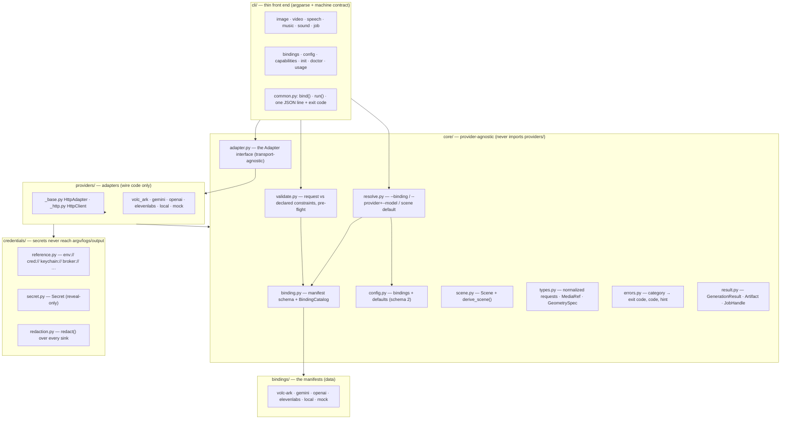

# Architecture

`media-ai` generates images, video and audio through one normalized interface. A thin
CLI turns argv into a **normalized request**, resolution picks a **binding**, the
binding's **adapter** maps the request to one backend's wire format, and a normalized
result comes back. Everything above the adapter is shared; each backend's
idiosyncrasies live only inside its adapter.

## The unit of integration is a binding

A **binding** is one callable `(provider, model)` pair — `volc-ark/seedance-2.0`,
`heygen/seedance-2.0`. The same model reached through two providers is two bindings,
not one with a switch, because everything that matters about them differs: the wire
format, the scenes they serve, the parameter limits, the credential.

That split is the whole design. `provider` used to name five different things at once
— adapter code, credential namespace, config namespace, routing key, CLI flag — which
works exactly as long as a model has one provider.

## Declare the capabilities, code the wire

A binding has two halves:

| half | where | what it holds |
|---|---|---|
| **Manifest** | `src/media_ai/bindings/<provider>.toml` | scenes, constraints, lifecycle, how to authenticate, which adapter implements it |
| **Adapter** | `src/media_ai/providers/<provider>.py` | the wire: request mapping, polling, error mapping |

The manifest holds no wire logic, and the adapter holds no capability declarations.
A manifest that also described request mapping would have to express Ark's
create→poll→cancel with billed-task cancellation, Veo's long-running operation plus
an authenticated download, and an internal Thrift client — a format that can express
those is a programming language, and a bad one.

The manifest is read by four consumers, which is what stops them drifting apart:
`media-ai capabilities` prints it, `validate_request` gates on it, `media-ai init`
builds its questions from it, and the packaged skills generate their per-binding
parameter tables from it.

## Layered structure



**The dependency rule:** arrows point down/inward. `core/` never imports `providers/`;
the CLI never imports a concrete adapter (it goes through the registry). A manifest's
`adapter` field is an import path resolved lazily, which is what lets an adapter live
in a private package.

## Request lifecycle

```mermaid
sequenceDiagram
    participant Skill as Agent Skill / shell
    participant CLI as cli + common.bind
    participant Res as core.resolve
    participant Val as core.validate
    participant Adp as Adapter
    participant API as backend (HTTP / RPC / local)

    Skill->>CLI: media-ai video generate --first-frame a.png …
    CLI->>CLI: argv → VideoRequest → derive_scene() = video.image_to_video
    CLI->>Res: resolve(binding?, provider?, model?, scene)
    Note over Res: nothing configured → error with hint; ambiguous → candidates
    Res-->>CLI: ResolvedBinding (spec + endpoint + credential ref + options)
    CLI->>CLI: check the binding serves this scene
    CLI->>Val: validate_request(req, spec.constraints)
    Note over Val: unsupported → exit 3, no network, no key needed
    CLI->>Adp: build_adapter(rb).generate_video(req)
    Adp->>Adp: resolve credential, reveal only in the request builder
    Adp->>API: wire request
    API-->>Adp: bytes / job id
    Adp-->>CLI: GenerationResult (or JobHandle)
    CLI-->>Skill: one JSON line, meta.binding + meta.scene, exit 0
```

## Scenes

A **scene** is the fine-grained kind of generation, derived from the inputs a caller
passed rather than chosen by a flag: `video.text_to_video`, `video.image_to_video`,
`video.keyframe_to_video`, `video.reference_to_video`, `video.extend`,
`video.concat`, `image.text_to_image`, `image.image_to_image`,
`speech.text_to_speech`, `speech.dialogue`, `music.{text_to,plan_to}_music`,
`music.plan`, `sound.text_to_sound`, `animation.from_video`,
`animation.from_frames`.

Scene is the **semantic role of the inputs, not their file type** — a video passed as
reference material and a video passed to continue from are different scenes, which is
why `--reference-video` and `--continue-from` are separate flags.

The corollary bounds it: a capability that does not change the input roles is not a
scene. Seedream 5.0 pro's coordinate editing takes exactly the inputs of
image-to-image and differs only in prompt syntax, so it is a capability flag plus a
documented technique. Neither is exporting a *transparent* animation: it takes the same
inputs as an opaque one and changes only the output, so it is `--transparent`, while a
frame sequence — genuinely a different input role — is the second animation scene.

A group carries the modality of what it **produces**, which is why `animation` is its
own group rather than a scene under `video`: an animated GIF/WebP/APNG is served as an
image whichever way it was made, and `modality` is the field a consumer branches on.

## Nothing falls back

Resolution refuses rather than substituting: unconfigured, ambiguous or unsuitable
all raise, carrying a stable `error.code`, the candidates, and a runnable `hint`.
Choosing again after a failure belongs to the agent driving the CLI, which knows what
the run is for.

The one automatic choice is the scene **default**: a call naming no binding uses the
configured entry for its scene. That exists because `--provider`/`--model` are flags a
model may not have learned, so a bare invocation has to work.

## Module responsibilities

| Area | What it owns |
|---|---|
| `core/binding.py` | Manifest schema (`ProviderSpec`/`BindingSpec`/`Constraints`), parser, `BindingCatalog` |
| `core/config.py` | `config.toml` schema 2 — bindings + scene defaults, `extends`; migrates an older file, refuses a newer one, and preserves fields it does not model |
| `core/resolve.py` | Addressing, `ResolvedBinding`, the refusal taxonomy |
| `core/scene.py` | `Scene` + derivation from a request |
| `core/validate.py` | Request vs declared constraints, before any call |
| `core/adapter.py` | The `Adapter` interface — no transport assumptions |
| `core/registry.py` | Catalog assembly (built-in + entry points), adapter loading |
| `core/{errors,result}.py` | Category→exit code, `code`/`hint`; result + JobHandle shapes |
| `credentials/` | Reference resolution, reveal-only `Secret`, `redact()` |
| `providers/_base.py`,`_http.py` | Optional HTTP layer: auth headers from the manifest, retry + idempotency |
| `bindings/*.toml` | The declarations themselves |
| `cli/` | argparse front ends; `common.py` owns `bind()` and the machine contract |

## Extension points

- **A new model on an existing provider** — usually one manifest entry, no code.
- **A new provider** — a manifest plus an `Adapter` subclass (~200–300 lines), shipped
  in-process (`register_manifest`) or as a `media_ai.bindings` entry point.
- **A non-HTTP backend** — `transport = "rpc"`: no base URL, no HTTP client, no status
  mapping. The adapter builds its own connection. See [EXTENDING.md](EXTENDING.md).
- **A new credential source** — register a scheme with `register_secret_backend`.
- **A new scene** — add a `Scene` value, its derivation, and declare it where served.
